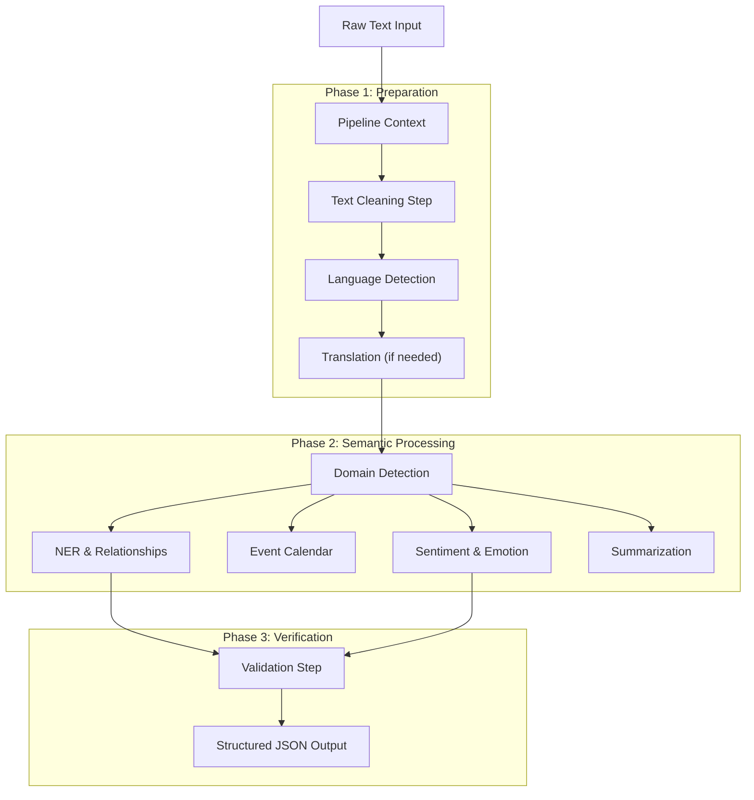

# Chain-of-Thought (CoT) Pipeline: Comprehensive Project Documentation

## 1. Project Overview

The **Chain-of-Thought (CoT) Pipeline** is a sophisticated text processing system designed to analyze, clean, and extract structured intelligence from unstructured text. Unlike traditional NLP pipelines that rely on simple API calls, this system implements **agentic reasoning** at every step.

### Key Philosophy
The core philosophy is **"Think before you speak."**
Every processing step (cleaning, classification, extraction) is forced to go through a **Chain-of-Thought** process where the AI must:
1.  **Analyze** the input deeply.
2.  **Plan** its approach.
3.  **Reason** about edge cases.
4.  **Verify** its own conclusions.
5.  **Output** the final structured result.

### High-Level Architecture

The system is built as a modular pipeline where data flows through a series of "Steps."



---

## 2. Core Framework (The Engine)

The system is powered by a custom framework located in `src/cot/`.

### 2.1. The Pipeline (`CoTPipeline`)
**File:** `src/cot/pipeline.py`

The `CoTPipeline` is the orchestrator. It does not perform analysis itself but manages the lifecycle of a request.
-   **Context Passing:** It creates a `PipelineContext` object that travels through every step. If Step 1 (Cleaning) modifies the text, Step 2 (NER) sees the cleaned version, but can still access the original if needed.
-   **Error Handling:** It wraps every step in try/catch blocks. If a non-critical step fails (e.g., Summarization), the pipeline continues.
-   **Configuration:** Controlled by `PipelineConfig`, allowing you to toggle features (e.g., `enable_ner=True`, `enable_sentiment=False`) dynamically.

### 2.2. The Executor (`StepExecutor`)
**File:** `src/cot/executor.py`

This is the brain of the operation. It handles all interactions with the Groq Large Language Model (LLM).

**Key innovation: Enhanced CoT prompting**
Instead of just asking "Extract entities," the executor wraps every request in a rigorous 5-step reasoning protocol:
1.  **Understanding:** Identify what is being asked.
2.  **Analysis:** Break down the input.
3.  **Self-Questioning:** "What could I be missing?" "Are there other interpretations?"
4.  **Verification:** Check consistency.
5.  **Synthesis:** Formatting the output.

**Self-Consistency (`SelfConsistencyExecutor`)**
For critical tasks, the system can run the same prompt multiple times (e.g., 3 times) with slightly different "temperatures" (randomness) and vote on the best answer. This significantly reduces hallucinations.

### 2.3. Structured Function Calling
**File:** `src/cot/__init__.py` (FunctionDefinition)

The system enforces strictly structured output (JSON) using `FunctionDefinition` schemas. This ensures that the AI doesn't just return a paragraph of text, but a parseable object.

Example Schema for Domain Detection:
```json
{
  "name": "detect_domain",
  "parameters": {
    "primary_domain": {"type": "string", "enum": ["technology", "business", "general"]},
    "confidence": {"type": "number"}
  }
}
```

---

## 3. The SERAX Protocol
**File:** `src/serax/`

**SERAX** (Structured Extraction with Rare-character Anchors for eXtraction) is a custom protocol developed for this project.

### Why not just JSON?
While the main pipeline uses JSON, complex tasks like **Semantic Cleaning** and **NER** use SERAX because LLMs often struggle to output valid JSON when the content itself contains code, quotes, or brackets.

### How it works
SERAX uses rare Unicode characters that act as unbreakable anchors:
-   `⟐` (U+27D0): Start of Block
-   `⊶` (U+22B6): Start of Field Name
-   `⊷` (U+22B7): End of Field / Start of Value
-   `⊸` (U+22B8): Field Separator
-   `⊹` (U+22B9): End of Block

**Example:**
`⟐⊶cleaned_text⊷Hello World⊸⊶reasoning⊷Removed noise⊹`

This makes parsing robust even if the text contains broken JSON or code snippets.

---

## 4. Processor Modules (The Brains)

Each module in `src/processors/` is a specialist agent.

### 4.1. ERA-CoT Named Entity Recognition (NER)
**File:** `src/processors/ner_extractor.py`

This is the most advanced module. It implements **Extraction-Relationship-Analysis (ERA)** using Chain-of-Thought.

**The 5-Step Process:**
1.  **Entity Extraction:** Finds People, Orgs, Dates, etc. Uses Self-Consistency (runs 3 times and votes).
2.  **Explicit Relationship Extraction:** Finds relationships explicitly stated in text (e.g., "Tim Cook is CEO of Apple").
3.  **Implicit Relationship Inference:** Logic reasoning to find hidden links (e.g., "iPhone 15 released by Apple" + "Tim Cook announced iPhone 15" -> **Infers**: "Tim Cook works for Apple").
4.  **Relationship Discrimination:** Scores inferred relationships (0-10) and discards weak ones (Threshold < 6.0).
5.  **Output Generation:** Returns structured graph data.

### 4.2. Advanced Sentiment Analysis
**File:** `src/processors/sentiment_analyzer.py`

Goes beyond simple Positive/Negative.
-   **Anti-National Detection:** Specifically looks for content promoting terrorism, separatism, or hatred against the nation. This is a separate score from negative sentiment.
-   **Fine-grained Emotions:** Detects 8 emotions (Joy, Anger, Fear, Sadness, Disgust, Surplus, Trust, Anticipation).
-   **Aspect-Based:** Can say "Sentiment towards UI is Positive" but "Sentiment towards Price is Negative".

### 4.3. Event Calendar Extraction
**File:** `src/processors/event_extractor.py`

Extracts temporal events (Past and Future).
-   **Normalization:** Converts "next Tuesday" or "Q3 2025" into actual dates `YYYY-MM-DD`.
-   **Categorization:** Classifies events into `Launch`, `Meeting`, `Holiday`, etc.
-   **Timeline:** sort events chronologically.

### 4.4. Summarization
**File:** `src/processors/summarizer.py`

Supports multiple strategies:
-   **Abstractive:** Writes a new summary from scratch.
-   **Extractive:** Picks the most important sentences from the source.
-   **Hierarchical (Map-Reduce):** For very long documents. Splits text into chunks, summarizes each chunk, then summarizes the summaries.
-   **Hallucination Check:** After generating a summary, it runs a self-check to ensure no numbers or entities were invented.

### 4.5. Semantic Cleaning
**File:** `src/cleaners/semantic_cleaner.py`

A smart cleaner that uses an LLM to decide what is "noise".
-   **Rule-based:** Deletes HTML tags (dumb).
-   **Semantic:** "Remove the navigation menu, but keep the technical definition of API."
-   **Expansion:** Expands obscure acronyms for clarity (e.g., "ML" -> "Machine Learning") if helpful for context.

---

## 5. Technical concepts & Theory

### What is "Chain-of-Thought" (CoT)?
Standard Large Language Models (LLMs) often guess the answer immediately. CoT is a technique where we force the model to output a "thought process" before the final answer.
-   **Without CoT:** Input: "Apple stock?" -> Output: "Technology."
-   **With CoT:** Input: "Apple stock?" -> Thought: "Apple refers to Apple Inc. They make iPhones. This is a business topic. Specifically, stock relates to finance." -> Output: "Business/Finance."

### What is "In-Context Learning"?
The modules use "Few-Shot Prompting." We provide the LLM with examples of correct behavior inside the prompt itself. This teaches the model exactly how we want the output without needing to fine-tune the model weights.

### What is "Self-Consistency"?
A technique to improve accuracy. If you ask a complex question once, the model might hallucinate. If you ask it 3 times (with some randomness) and take the majority vote, the accuracy increases dramatically. This pipeline uses this for **Domain Detection** and **NER**.

---

## 6. Directory Structure

```text
chain_of_thoughts/
├── src/
│   ├── cot/                 # CORE FRAMEWORK
│   │   ├── pipeline.py      # The main runner
│   │   ├── executor.py      # LLM handler & CoT logic
│   │   └── steps.py         # Concrete step definitions
│   │
│   ├── processors/          # BUSINESS LOGIC
│   │   ├── ner_extractor.py # ERA-CoT NER
│   │   ├── sentiment_analyzer.py # Sentiment & Anti-national
│   │   └── ... (others)
│   │
│   ├── serax/               # PARSER PROTOCOL
│   │   └── ...              # Custom format parsers
│   │
│   ├── cleaners/            # TEXT CLEANING
│   │   └── semantic_cleaner.py
│   │
│   └── utils/               # HELPERS
│       └── groq_client.py   # API wrapper
│
├── main.py                  # CLI Entry Point
└── requirements.txt         # Dependencies
```

## 7. How to Read the Code

If you want to understand how a specific feature works, follow this path:
1.  **Start at `src/cot/pipeline.py`**: See where the step is added to the list.
2.  **Go to `src/cot/steps.py`**: See the wrapper class (`Step`) that defines the prompt.
3.  **Go to `src/processors/[module].py`**: See the actual logic class (e.g., `SentimentAnalyzer`).
4.  **Look for `SYSTEM_PROMPT`**: This constant text explains exactly what instructions the AI is given.
